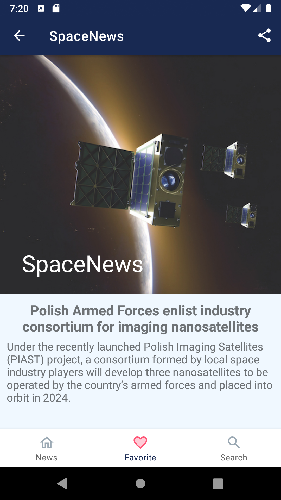

# SpaceNews
An android application that allows you to read and save articles related to the subject of spaceflights and space. By using the Spaceflight News API, news are downloaded by using retrofit. The application is written in the MVVM architecture, using Dagger Hilt as Dependency Injection. Room is used to save articles. Additionally, the following technologies were used: Glide, Coroutines and Navigation Components.

## Table of contents:
* [General info](#general-info)
* [Technologies](#technologies)
* [Illustrations](#illustrations)

## Technologies
Project is created with:
* Kotlin
* Android Studio
* Gradle
* Material Design
* Room
* Kotlin Extensions and Coroutines 
* Retrofit
* Glide
* Dagger - Hilt
* Navigation Components
* Gson

## Illustrations

 
 
 
 
 
 
 

